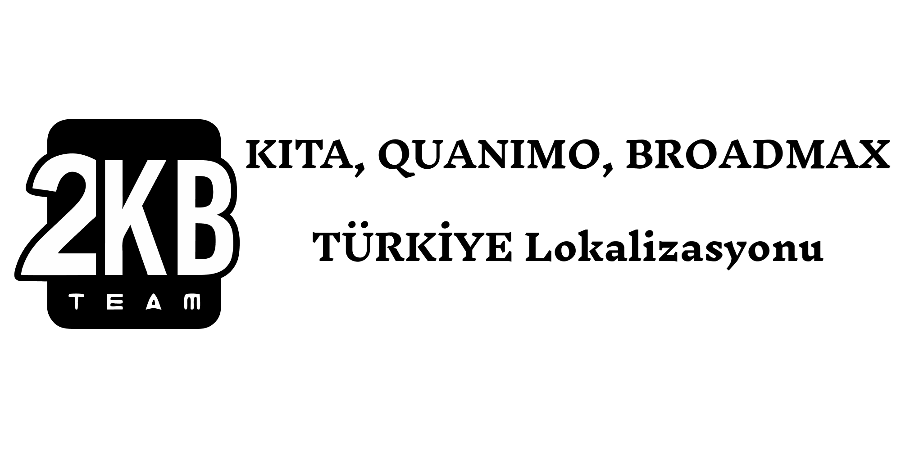
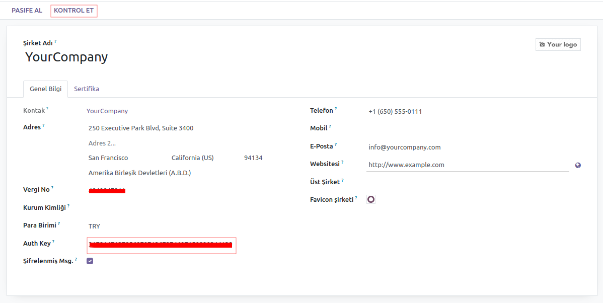

<!-- Improved compatibility of başa dön link: See: https://github.com/othneildrew/Best-README-Template/pull/73 -->
<a name="readme-top"></a>
<!--
*** Thanks for checking out the Best-README-Template. If you have a suggestion
*** that would make this better, please fork the repo and create a pull request
*** or simply open an issue with the tag "enhancement".
*** Don't forget to give the project a star!
*** Thanks again! Now go create something AMAZING! :D
-->


<!-- PROJECT SHIELDS -->
<!--
*** I'm using markdown "reference style" links for readability.
*** Reference links are enclosed in brackets [ ] instead of parentheses ( ).
*** See the bottom of this document for the declaration of the reference variables
*** for contributors-url, forks-url, etc. This is an optional, concise syntax you may use.
*** https://www.markdownguide.org/basic-syntax/#reference-style-links
-->
[![Contributors][contributors-shield]][contributors-url]
[![Forks][forks-shield]][forks-url]
[![Stargazers][stars-shield]][stars-url]
[![Issues][issues-shield]][issues-url]
[![MIT License][license-shield]][license-url]
[![LinkedIn][linkedin-shield]][linkedin-url]


<!-- PROJECT LOGO -->
<br />
<div align="center">
  <a href="https://github.com/Odoo-Turkey-Community/e_donusum">
    
  </a>

<h3 align="center">Account Chart Update TR</h3>

  <p align="center">
    Muhasebe hesaplarınızı e-dönüşüm ve türkiye muhasebesine uyumlu hale getirir.
    <br />
    <br/>
    <a href="https://github.com/Odoo-Turkey-Community/e_donusum/"><strong>Lokalizasyonu Keşfet »</strong></a>
    <br />
    <h4 align="center">Test Ortamları</h4>
    <a href="https://demo.2kb.com.tr/">Temel Test Ortamı</a>
    ·
    <a href="https://demop.2kb.com.tr/">Pro Test Ortamı</a>
    ·
    <a href="https://demos.2kb.com.tr/">Enterprise Test Ortamı</a><br/>
    <span style="color:red">Login Bilgileri; Mail: admin, Şifre: admin</span>
    <br/>
    <br/>
    <a href="https://github.com/Odoo-Turkey-Community/e_donusum/issues/new?labels=bug&template=bug-report.md">Hata Bildir</a>
    ·
    <a href="https://github.com/Odoo-Turkey-Community/e_donusum/issues/new?labels=enhancement&template=feature-request.md">Yeni Özellik Talebi</a>
  </p>
</div>


<!-- TABLE OF CONTENTS -->
<details>
  <summary>İçerik Tablosu</summary>
  <ol>
    <li>
      <a href="#about-the-project">Proje Hakkında</a>
      <ul>
        <li><a href="#built-with">Bileşenler</a></li>
      </ul>
    </li>
    <li>
      <a href="#getting-started">Başlarken</a>
      <ul>
        <li><a href="#prerequisites">Ön Gereksinimler</a></li>
        <li><a href="#installation">Kurulum</a></li>
      </ul>
    </li>
    <li><a href="#usage">Kullanımı</a></li>
    <li><a href="#contributing">Katkılar</a></li>
    <li><a href="#license">Lisans</a></li>
    <li><a href="#contact">İletişim</a></li>
  </ol>
</details>


<!-- ABOUT THE PROJECT -->
<a name="about-the-project"></a>
## Proje Hakkında

<div align="center">
  <a href="https://github.com/Odoo-Turkey-Community/e_donusum">
    
  </a>
 </div>

Muhasebe hesaplarınızı e-dönüşüm ve türkiye muhasebesine uyumlu hale getirir: `Odoo-Turkey-Community`, `e_donusum`, `kitayazilim.com`, `quanimo.com`, `broadmax.com.tr`, `info@2kb.com.tr`, `Türkiye Lokalizasyonu`, `Odoo Türkiye lokalizasyonu 2kb konsorsiyumu`

<p align="right">(<a href="#readme-top">başa dön</a>)</p>


<a name="built-with"></a>
### Bileşenler
<ul style="list-style:none">
<li style="padding:5px">
<a href="https://odoo.com">
    
  </a>
</li>
<li style="padding:5px">
<a href="https://2kb.com.tr">
    
  </a>
</li>
<li style="padding:5px">
<a href="https://kitayazilim.com">
    
  </a>
</li>
<li style="padding:5px">
<a href="https://quanimo.com">
    
  </a>
  </li>
<li style="padding:5px">
<a href="https://broadmax.com.tr/">
    
  </a>
</li>
<li style="padding:5px">
<a href="https://izibiz.com.tr">
    
  </a>
</li>
<li style="padding:5px">
<a href="https://nes.com.tr">
    
  </a>
</li>
<li style="padding:5px">
<a href="https://www.vomsis.com">
    
  </a>
</li>
</ul>

<p align="right">(<a href="#readme-top">başa dön</a>)</p>


<!-- GETTING STARTED -->
<a name="getting-started"></a>
## Başlarken 

2KB Konsorsiyumu tarafından geliştirilen Türkiye Muhasebe altyapısı ve E-Dönüşüm süreçleri ile ilgili geliştrimeler tüm kullanıcıların kullanmına ücretsiz olarak sunulmuştur. İster Enterprise ister Community versiyonunda konforlu bi şekilde kullanabilir ve muhasebe süreçlerinizi yönetebilirsiniz.

E-Dönüşüm için başvurunuzu Partner iseniz [İş Ortağı Kaydı](https://2kb.com.tr/tr/partnership_request) son kullanıcısı iseniz [Kullanıcı Kaydı](https://2kb.com.tr/tr/end_user_registration) linklerinden geçerli bilgilerinizle formu doldurarak yapabilirsiniz.


<a name="prerequisites"></a>
### Ön Gereksinimler

Uygulamayı üzerinde çalıştıracağınız hazır [Odoo](https://www.odoo.com/tr_TR) Enterprise ya da Community lisanlı bir Odoo ekosistemi.
* Lisans versiyonları
  ```sh
  Odoo Enterprise, Community
  ```
* Sürüm versiyonları
  ```sh
  Odoo v16, v17, v18
  ```
  
  
<a name="installation"></a>
### Kurulum

1. Ücretsiz APi Anahtarı alın. Api anahtarı almak için uygulama üzerinden istekte bulunabilirsiniz
2. Repo yu klonlayın ya da odoo apps üzerinden [E-Dönüşüm Altyapısı](https://apps.odoo.com/apps/modules/16.0/gib_base_2kb) addonunu indirin.
Addonlara erişimlerinizi farklı repolar üzerinden yapabilirsiniz. Sizler için oluşturduğumuz 2 repo üzerinden şu şekilde de uygulamalara erişebilirsiniz.

   1. Yol 2KB tarafından geliştirilen ve e-dönüşüm süreçlerini yürütebileceğiniz temel uygulamalara erişim:
      ```sh
      git clone https://github.com/Odoo-Turkey-Community/e_donusum.git
      ```

   2. Yol 2KB uygulamaları yanı sıra Uygulama bağımlılıklarını ya da ihtiyaç duyabileceğiniz uygulamaları da içeren Submodül yapısı ile hazırlanmış repo:
   öncelikle aşağıdaki kodu çalıştıralım
      ```
      git clone https://github.com/Odoo-Turkey-Community/edonusum_paket_community.git
      ```
      > komut tamamlandıktan sonra ilgili klasörde dizin yapısı dizinler "BOŞ" halde gelecektir, dizinlerin bulunduğu ana dizine gidelim ve uygulama dosyalarını da almak için komut satırında      
      ```
      git submodule update --init --recursive
      ```
      komutunu çalıştıralım. Bu komut dizesi recursive olarak submodüllerden içerikleri alıp kendi dizinlerine ekleyecektir.
      Branchların ayarlanması; submodülleri istenilen branchlara checkout yapmak için
      ```
      git submodule foreach 'git checkout 16.0 || :'
      ```
      komut satırını çalıştırmanız yeterli olacaktır. örneğin bu komut satırında bütün submodüller 16.0 branchına checkout edilecektir.
      Kaynak kodlarınızı yenilemek yani bütün submodüllerden son commitleri almak için ise
      ```
      git submodule update --remote --recursive
      ```
      komut satırını çalıştırmanız yeterli olacaktır böylece son commitleri almış olacaksınız

3. İçerisindeki addonları Odoo ekosisteminize kurun
4. Aldığınız api anahtarınızı uygulamanızda Company Detayındaki Auth Key kısma yazınız
   ```js
   Auth Key = '2KB Lisans Anahtarınızı Girin'
   ```
5. "2KB Etkinleştirme" Butonununa Tıklayınız "2KB dünyasına hoş geldiniz." mesajını gördüğünüzde etkinleştirme talebiniz tarafımıza ulaşacaktır. "Kontrol Et" butonundan talebinizi tekrar sorgulayabilirsiniz




> [!IMPORTANT]
> Bundan sonraki süreçler sizinle irtibata geçen 2KB ekibi tarafından sizinle birlikte yürütülecektir. Entegratör aktivasyonu ve Talebinizin etkinleştirilmesi gibi...


<p align="right">(<a href="#readme-top">başa dön</a>)</p>


<!-- USAGE EXAMPLES -->
<a name="usage"></a>
## Kullanımı

- Kurulum süreçlerini tamaladıktan sonra Entegratör API bilgilerini Yapılandırma > Entegratörler > Kullanacağınız entegratör ayarlarından giriniz.

- Döküman Logosu: faturalarda görüntülenecek logonuz
Döküman İmzası: E-Arşiv faturalarında imza kısmına görüntülenecek imza görseli bu iki görseli ekledikten sonra "Şablonları Yapılandır" butonuyla şablonları oluşturun.

- GİB Veri butonundan alıcı ve gönderi PK ve GB lerini alabilirsiniz. Veri alamadığınız durumda şirket VKN bilgisini kontrol ediniz.

- Kontaklar Uygulamasından İş Ortaklarınızın E-Dönüşüm bilgilerini "GİB Veri Güncelle" butonuyla tek sefere mahsus çekebilirsiniz.

- İş Ortağı kartından varsayılan değerleri ayarlayabilirsiniz. Burada set edilen değerler iş ortağına fatura kesilirken varsayılan olarak kulanılır

- Siparişten ya da doğrudan oluşturulan faturalarınız İş Ortağınızın E-Dönüşüm parametrelerine göre fatura onaylandıktan sonra GİB e gönderilir

_Daha fazla detay için, lütfen takipte kalın ve iletişime geçin [2KB Ekibi](https://2kb.com.tr)_

<p align="right">(<a href="#readme-top">başa dön</a>)</p>


<!-- CONTRIBUTING -->
<a name="contributing"></a>
## Katkılar

Odoo Türkiye lokalizasyonuna çözüm alternatifi olarak ortaya çıkarılan bu üründe temel amaç Odoo nun türkiye lokalizasyonunda ve yerel tüm çözümlerinde sürekliliği sağlamaktır.

<a href="https://2kb.com.tr">
    
  </a>
</li> tarafından hizmetinize sürülen bu ürün <a href="https://2kb.com.tr">
    
  </a>
</li> yi oluşturan konsorsiyum üyeleri;
<ul style="list-style:none">
<li style="padding:5px">
<a href="https://kitayazilim.com">
    
  </a>
</li>
<li style="padding:5px">
<a href="https://quanimo.com">
    
  </a>
  </li>
<li style="padding:5px">
<a href="https://broadmax.com.tr/">
    
  </a>
</li>
</ul>
tarafından geliştirilmiş ve bundan sonraki süreçlerde ise geliştirmeye devam edilecek, desteklenecek ve versiyon yükseltmelerinde gerekli çalışmalar yapılacaktır.

<p align="right">(<a href="#readme-top">başa dön</a>)</p>


<!-- LICENSE -->
<a name="license"></a>
## Lisans

Distributed under the MIT License. See `LICENSE.txt` for more information.

<p align="right">(<a href="#readme-top">başa dön</a>)</p>


<!-- CONTACT -->
<a name="contact"></a>
## İletişim

2KB - [2KB Ekibi](https://2kb.com.tr/contactus) - info@2kb.com.tr

2KB - [Kullanıcı Kaydı](https://2kb.com.tr/end_user_registration) - Başvurusu

2KB - [İş Ortağı Kaydı](https://2kb.com.tr/partnership_request) - Başvurusu

Kıta  - [Kıta Yazılım](https://kitayazilim.com/contactus) - info@kitayazilim.com

Kıta  - Metin GÜLSOY - metin.gulsoy@kitayazilim.com

Quanimo  - [Quanimo](https://quanimo.com/contactus) - info@quanimo.com

Quanimo  - Fatih ÖZKAN - mfozkan@quanimo.com

Broadmax  - [Broadmax](https://broadmax.com.tr/contactus) - advisors@broadmax.com.tr

Broadmax  - M.Kamal HABBABA - habbaba@broadmax.com.tr

Broadmax  - Mahmut ŞAKAR - mahmutsakarmail@gmail.com

Proje Linki: [https://github.com/Odoo-Turkey-Community/e_donusum.git](https://github.com/Odoo-Turkey-Community/e_donusum.git)

<p align="right">(<a href="#readme-top">başa dön</a>)</p>


<!-- MARKDOWN LINKS & IMAGES -->
<!-- https://www.markdownguide.org/basic-syntax/#reference-style-links -->
[contributors-shield]: https://img.shields.io/github/contributors/Odoo-Turkey-Community/e_donusum.svg?style=for-the-badge
[contributors-url]: https://github.com/Odoo-Turkey-Community/e_donusum/graphs/contributors
[forks-shield]: https://img.shields.io/github/forks/Odoo-Turkey-Community/e_donusum.svg?style=for-the-badge
[forks-url]: https://github.com/Odoo-Turkey-Community/e_donusum/network/members
[stars-shield]: https://img.shields.io/github/stars/Odoo-Turkey-Community/e_donusum.svg?style=for-the-badge
[stars-url]: https://github.com/Odoo-Turkey-Community/e_donusum/stargazers
[issues-shield]: https://img.shields.io/github/issues/Odoo-Turkey-Community/e_donusum.svg?style=for-the-badge
[issues-url]: https://github.com/Odoo-Turkey-Community/e_donusum/issues
[license-shield]: https://img.shields.io/github/license/Odoo-Turkey-Community/e_donusum.svg?style=for-the-badge
[license-url]: https://github.com/Odoo-Turkey-Community/e_donusum/blob/master/LICENSE
[linkedin-shield]: https://img.shields.io/badge/-LinkedIn-black.svg?style=for-the-badge&logo=linkedin&colorB=555
[linkedin-url]: https://linkedin.com/in/linkedin_username
